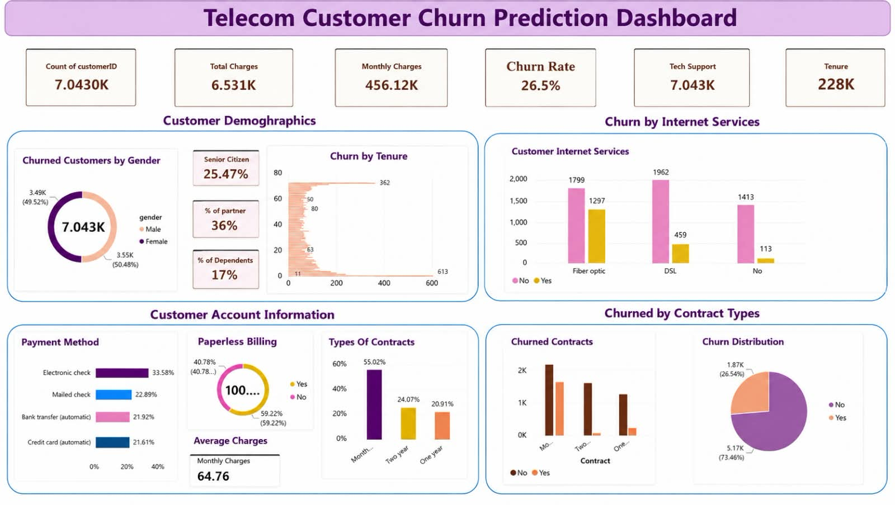

# 📊 Telecom Customer Churn Analysis Dashboard

## 📌 Project Overview

This project presents an interactive Telecom Customer Churn Analysis Dashboard developed using Microsoft Power BI.

The dashboard analyzes customer behavior, churn patterns, demographics, billing information, and account details to generate useful business insights and support customer retention decisions.

## 🎯 Objectives

- Analyze customer churn patterns
- Identify customer segments with higher churn
- Analyze customer demographics
- Understand payment and billing behavior
- Analyze customer account information
- Support data-driven customer retention decisions

## 🛠️ Tools & Technologies

- Microsoft Power BI
- Power Query
- DAX
- Data Visualization
- Data Analysis

## 📊 Dashboard Features

### Customer Demographics

- Churned Customers by Gender
- Senior Citizen Analysis
- Partner Analysis
- Dependent Customer Analysis

### Customer Account Information

- Payment Method
- Paperless Billing
- Contract Type
- Monthly Charges
- Total Charges
- Customer Tenure

## 📈 Key KPIs

- Total Customers
- Total Charges
- Monthly Charges
- Churned Customers
- Customer Demographics

## 🖥️ Dashboard Preview



## 📁 Project Structure

```text
Telecom-Customer-Churn-Dashboard/
│
├── Dashboard DWM.pbix
├── README.md
│
├── Screenshot/
│   └── Dashboard.jpeg
│
└── Dataset/
    └── WA_Fn-UseC_-Telco-Customer-Churn.csv

## 👩‍💻 Author

**Ashwini Sirsat**

B.Tech – Artificial Intelligence & Data Science

